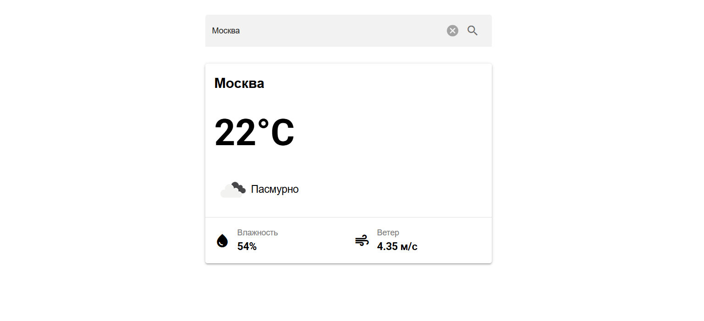

## Preview



# 🌤 Weather App


Приложение для просмотра текущей погоды с использованием **OpenWeatherMap API**.

Проект реализован на **Vue 3 + TypeScript** с использованием **Composition API**, **Pinia** для управления состоянием и **Quasar Framework** для UI-компонентов.

Приложение автоматически определяет местоположение пользователя и отображает текущую погоду, а также позволяет выполнять поиск погоды по названию города.

---

## 🚀 Features

### Реализованный функционал

✅ Автоматическое определение местоположения пользователя при загрузке приложения  
✅ Получение текущей погоды по координатам  
✅ Поиск погоды по названию города  
✅ Отображение:

- города;
- температуры;
- описания погоды;
- иконки;
- влажности;
- скорости ветра.

✅ Обработка ошибок:

- ошибки геолокации;
- ошибки API;
- сетевые ошибки.

✅ Индикатор загрузки  
✅ Адаптивная верстка для мобильных устройств и desktop  
✅ Полная TypeScript типизация  
✅ API ключ хранится в `.env`  
✅ Unit-тесты для бизнес-логики и компонентов

---

# 🛠 Tech Stack

## Core

- Vue 3
- Composition API
- TypeScript
- Vite
- Pinia
- Vue Router

## UI

- Quasar Framework

## API

- OpenWeatherMap API
- Axios

## Testing

- Vitest
- Vue Test Utils

---

# 📂 Project Structure

```
src/
│
├── api/
│   ├── axios.ts
│   └── weather.api.ts
│
├── components/
│   ├── MainLoader.vue
│   ├── SearchInput.vue
│   ├── WeatherCard.vue
│   └── WeatherInfo.vue
│   └── EmptyWeather.vue
│
├── composables/
│   └── useGeolocation.ts
│
├── services/
│   └── weather.service.ts
│
├── stores/
│   └── weather.store.ts
│
├── types/
│   ├── weather.ts
│   └── weather.dto.ts
│
├── views/
│   └── HomeView.vue
│
└── utils/
    └── constants.ts
```

---

# ⚙️ Installation

## 1. Clone repository

```bash
git clone <repository-url>
```

Перейдите в папку проекта:

```bash
cd weather-app
```

---

## 2. Install dependencies

```bash
npm install
```

---

# 🔑 Environment Variables

Создайте файл:

```
.env
```

Добавьте API ключ OpenWeatherMap, а также укажите базовый эндпоинт, по умолчанию - https://api.openweathermap.org/data/2.5:

```env
VITE_API_URL=your_url
VITE_API_KEY=your_api_key
```

# ▶️ Development

Запуск проекта в режиме разработки:

```bash
npm run dev
```

После запуска приложение будет доступно:

```
http://localhost:5173
```

---

# 📦 Production build

Создание production-сборки:

```bash
npm run build
```

# 🧪 Testing

Запуск тестов:

```bash
npm run test
```
